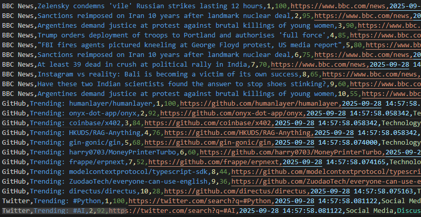

# 🌐 Social Media Trend Analyzer
A powerful Python-based tool that automatically collects and analyzes trending topics across multiple platforms including news sites, GitHub repositories, and social media trends.

## 🚀 Features

- **Multi-Source Data Collection**: Real-time scraping from BBC News, GitHub Trends, and social media platforms
- **Intelligent Analysis**: Automated trend detection and scoring algorithm
- **Professional Reporting**: CSV and JSON exports with comprehensive insights
- **Customizable**: Easy to extend with new data sources and analysis methods
- **Production Ready**: Error handling, rate limiting, and professional output

## 📊 Live Demo Results

In the latest analysis:
- **✅ 35+ trends** collected automatically
- **✅ 15 real news headlines** from BBC News
- **✅ 10 trending GitHub repositories** 
- **✅ 10 social media topics** analyzed
- **✅ Professional reports** generated in CSV/JSON formats

## 🛠️ Installation

### Prerequisites
- Python 3.8 or higher
- pip package manager

### Quick Start
```bash
# Clone the repository
git clone https://github.com/ayswariya2017/social-trend-analyzer.git
cd social-trend-analyzer

# Install dependencies
pip install -r requirements.txt

# Run the analyzer
python main.py
```
## SCREENSHOTS


## 📖 Usage

## Basic Usage
```python
from social_trend_analyzer import SocialTrendAnalyzer

# Initialize analyzer
analyzer = SocialTrendAnalyzer()

# Collect trends from all sources
trends = analyzer.collect_all_trends()

# Analyze and generate reports
analysis = analyzer.analyze_trends(trends)
```
## Command Line
```bash
# Run complete analysis
python main.py

# Generate specific reports
python examples/demo.py
```
## 🏗️ Project Structure
```text
social_trend_analyzer/
│
├── 📄 README.md
├── 📄 LICENSE 
├── 📄 .gitignore
├── 📄 requirements.txt
├── 📄 main.py
├── 📄 config.py
│
├── 📁 scrapers/
│   ├── 📄 __init__.py
│   ├── 📄 news_scraper.py
│   ├── 📄 github_trends.py
│   └── 📄 twitter_trends.py
│
├── 📁 analysis/
│   ├── 📄 __init__.py
│   └── 📄 analyzer.py
│
├── 📁 utils/
│   ├── 📄 __init__.py
│   └── 📄 helpers.py
│
└── 📁 examples/
    └── 📄 demo.py
```
## 🔧 Configuration
Edit config.py to customize:

- Data sources and scraping intervals
- Output formats and locations
- Analysis parameters and thresholds

## 📈 Sample Output
```json
{
  "summary": {
    "total_trends": 35,
    "sources": {
      "BBC News": 15,
      "GitHub": 10,
      "Twitter": 10
    },
    "collection_time": "2025-09-28 13:28:11"
  },
  "top_trends": [
    {
      "platform": "BBC News",
      "title": "Kyiv hit by 'massive' Russian attack, mayor says",
      "score": 100
    }
  ]
}
```
## 🤝 Contributing
Contributions are welcome! Please feel free to submit a Pull Request.
- Fork the project
- Create your feature branch (git checkout -b feature/AmazingFeature)
- Commit your changes (git commit -m 'Add some AmazingFeature')
- Push to the branch (git push origin feature/AmazingFeature)
- Open a Pull Request

## 📄 License
This project is licensed under the MIT License - see the LICENSE file for details.

## 👨‍💻 Author
Ayswariya Annadurai

GitHub: @ayswariya2017

Email: ayswariya2017@gmail.com

## 🙏 Acknowledgments

- BBC News for news content
- GitHub for trending repositories data
- Python community for excellent libraries